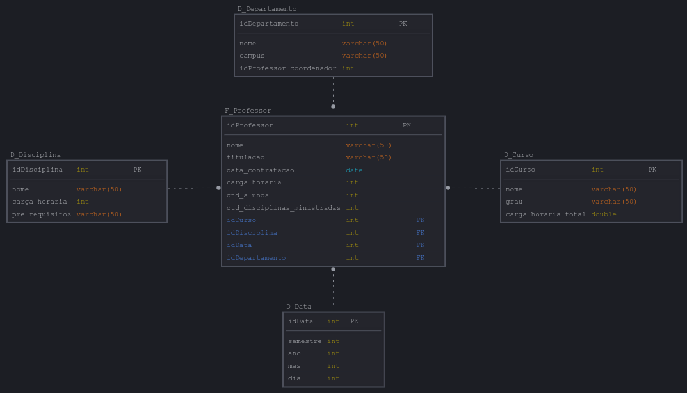

# Dashboard de Vendas com Power BI utilizando Star Schema
Resolução do desafio 'Dashboard de Vendas com Power BI utilizando Star Schema', do bootcamp oferecido pela NTTData, através da Digital Innovation One (DIO), no módulo 'Modelagem de Dados com Power BI'.

O documento com as instruções para o desenvolvimento do desafio encontra-se no seguinte [endereço eletrônico](https://academiapme-my.sharepoint.com/:w:/g/personal/renato_dio_me/EW6ICs-FWeJPjRJt5mhdTFABzxYtZl87MzYPc6s2N1aO7Q?e=kVro4X).

# Resolução
A modelagem do Star Schema foi realizado com o auxílio da ferramenta online [SqlDBM](https://sqldbm.com/Home/).

**Fato Professor:**
- idProfessor (identificador do professor)
- idCurso (chave estrangeira para a dimensão Curso)
- idDepartamento (chave estrangeira para a dimensão Departamento)
- idDisciplina (chave estrangeira para a dimensão Disciplina)
- idData (chave estrangeira para a dimensão Data)
- nome
- titulação (Ex.: Doutor, Mestre, Especialista)
- data_contratacao
- carga_horaria (medida: carga horária ministrada pelo professor)
- quantidade_alunos (medida: total de alunos vinculados ao professor)
- qtd_disciplinas_ministradas (medida: número de disciplinas ministradas pelo professor)

**Dimensão Curso:**
- idCurso (chave primária)
- nome
- grau (Ex.: Bacharelado, Licenciatura, Tecnólogo)
- carga_horaria_total (medida: carga horária total do curso)

**Dimensão Departamento:**
- idDepartamento (chave primária)
- nome
- campus
- idProfessor_coordenador (identificador do professor coordenador)

**Dimensão Disciplina:**
- idDisciplina (chave primária)
- nome
- carga_horaria (medida: carga horária da disciplina)
- pre_requisitos

**Dimensão Data:**
- idData (chave primária)
- ano
- mes
- dia
- semestre